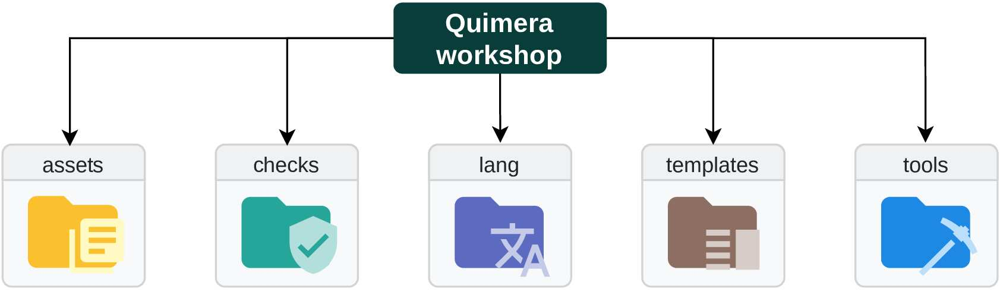
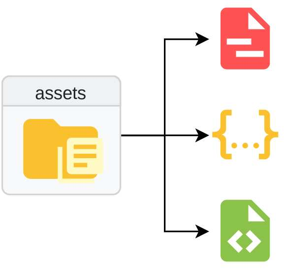
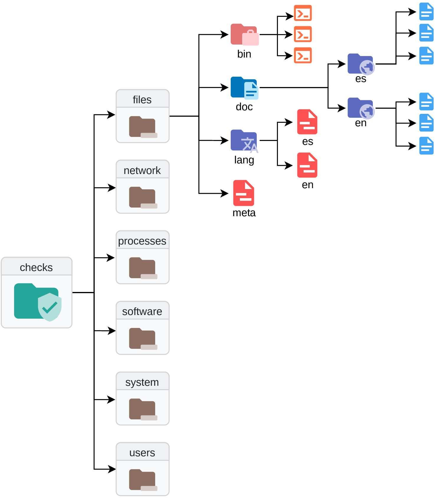
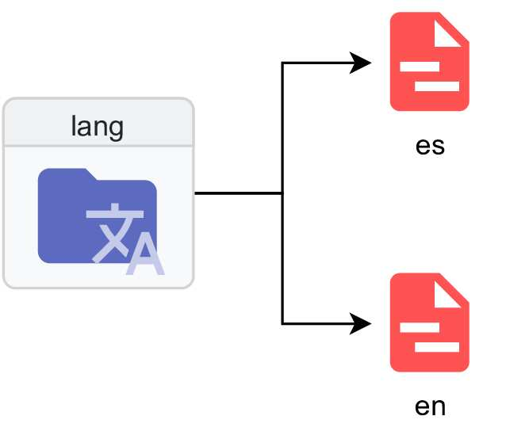
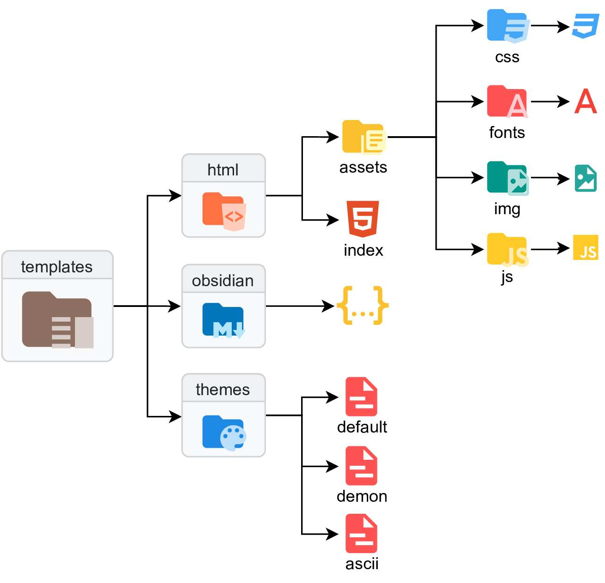
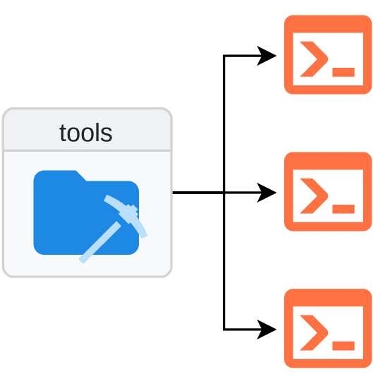

    
    
    
    
    

  

  <h1 align="center">Quimera Workshop</h1>

  

    Quimera Workshop se encarga de guardar todos los checks y configuraciones de Quimera, los cuales serán utilizados por Quimera Core durante la ejecución. El repositorio sigue una estructura modular pensada para ser ampliada de forma sencilla. Cuenta con un total de cinco carpetas, cada una diseñada para albergar información distinta, aunque complementaria.
  

> 🚧 Este proyecto proviene de un Trabajo Fin de Grado de Ingeniería de la Ciberseguridad. Se encuentra en una fase muy temprana del desarrollo y sufrirá diferentes cambios hasta llegar a una versión estable final.

## Instalación
> Quimera Workshop se instala automáticamente cuando Quimera Core no detecta el repositorio en el sistema.

## Distribución

    

### Assets

La carpeta assets se encarga de almacenar ficheros con configuraciones, variables o utilidades que puedan aprovechar los ejecutables de los checks. Normalmente serán archivos de tipo JSON, YAML o XML. Los assets están diseñados para aportar datos a los ejecutables, de forma independiente a ellos; cualquier variable o configuración de los assets, podrá ser modificada sin necesidad de modificar el ejecutable.

    

### Checks

La carpeta checks almacena los checks divididos en sus componentes más importantes. Primeramente se subdivide en distintas carpetas correspondientes con la categoría a la que pertenecen los checks que almacenan. Cada una de estas carpetas se organiza con la misma estructura. El archivo más importante es meta. Este archivo, en formato YAML, contiene los metadatos necesarios para poder formar los checks (mediante la técnica de deserialización), representados según un identificador. Además del archivo meta, estos directorios contienen una carpeta bin, encargada de almacenar los ejecutables de los checks. Pueden existir ejecutables utilizados por distintos checks, variando los parámetros que reciban. A su vez, el directorio lang almacena archivos, de tipo YAML, con los títulos de los checks, en el respectivo idioma señalizado por el nombre del fichero, referenciados según su identificador. Por último, el directorio doc se subdivide en carpetas que incluyen la documentación de cada check, en formato Markdown. El nombre de cada fichero Markdown hace referencia al identificador del check y el nombre de la carpeta al idioma de dicha documentación.

    

### Lang

La carpeta lang reúne ficheros, de tipo YAML, con diferentes mensajes utilizados por Quimera Core, en el respectivo idioma referenciado por el nombre del fichero.

    

### Templates

La carpeta templates recoge las diferentes plantillas utilizadas para la representación de la salida de Quimera Core. Se divide en tres carpetas. La carpeta html contiene la plantilla de HTML, CSS y JavaScript necesaria para generar la salida. El fichero index utiliza una sintáxis especial para poder ser utilizado por la librería estándar de HTML de Golang, con el fin de representar los checks recogidos durante la ejecución. Por otro lado, la carpeta obsidian incluye archivos de configuración y plugins, en formato JSON, para representar los checks en un formato interpretado por el programa Obsidian9. Por último, la carpeta themes, incluye archivos, en formato YAML, de la configuración de los distintos temas que incorpora Quimera. Los temas, cuyo nombre equivale al del fichero, permiten visualizar de formas distintas los checks.

    

### Tools

La carpeta tools incluye distintos binarios o scripts utilizados por los ejecutables de los checks durante su ejecución. Al igual que los assets, estos permiten configurarse independientemente.

    

